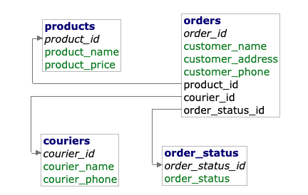

# Clothes Outlet Management App
This project is a CLI based app in Python for a mock clothes retailer to be able to persist data using CRUD procedures and also manage live orders. This app uses Docker contianers for MySQL and Adminer for connection to the database.

## Client Requirements
- Create, Read, Update and Delete information for all the products the business sells, orders and the couriers they use for delivery
- Track live orders and be able to update their order status
- Persist data when app closes, have the data saved for the next time the app is opened

## Database Schema


## Instructions on Running the App
- In the terminal run:
```
git clone https://github.com/neji-s/retailer-app.git
```

- Make sure you are in the src folder
- On Windows run:
```
py app.py
```
- On Mac run:
```
python3 app.py
```
